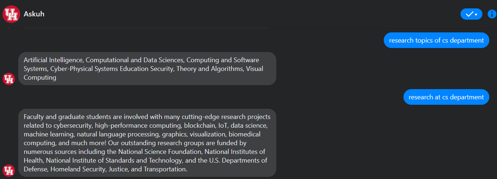
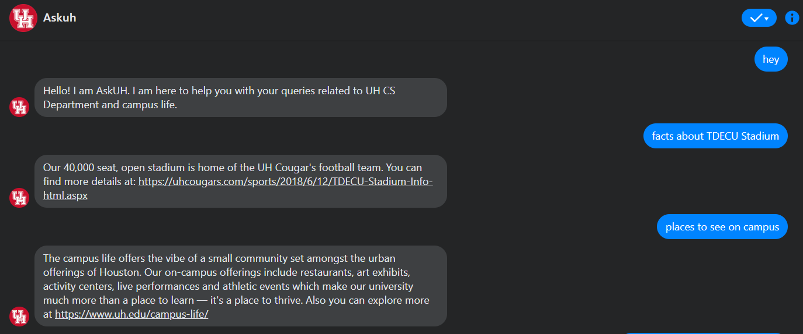
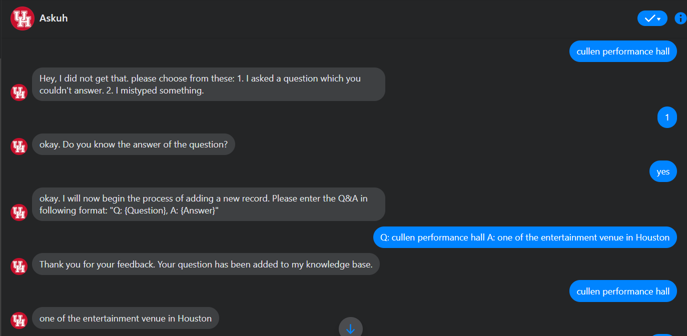
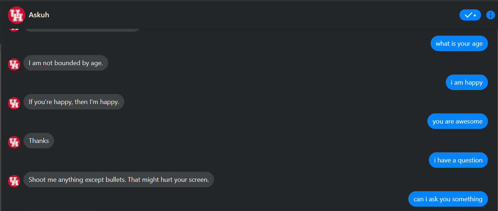

# AskUH

## How to test AskUH Assistant

1. Go to Askuh  [Facebook Page](https://www.facebook.com/profile.php?id=100088157080878)
2. Click on Message or you can go to Facebook Messenger 
3. Chat window will pop up and you can ask anything to Chatbot regarding Computer Science Department and Campus Live at University of Houston!

## Screenshots displaying functionalities of ChatBot

### CS Department Queries

### Campus Life Queries

### Knowledge Base Updation with Question and Answer Chatbot do not know

### Small Talks

